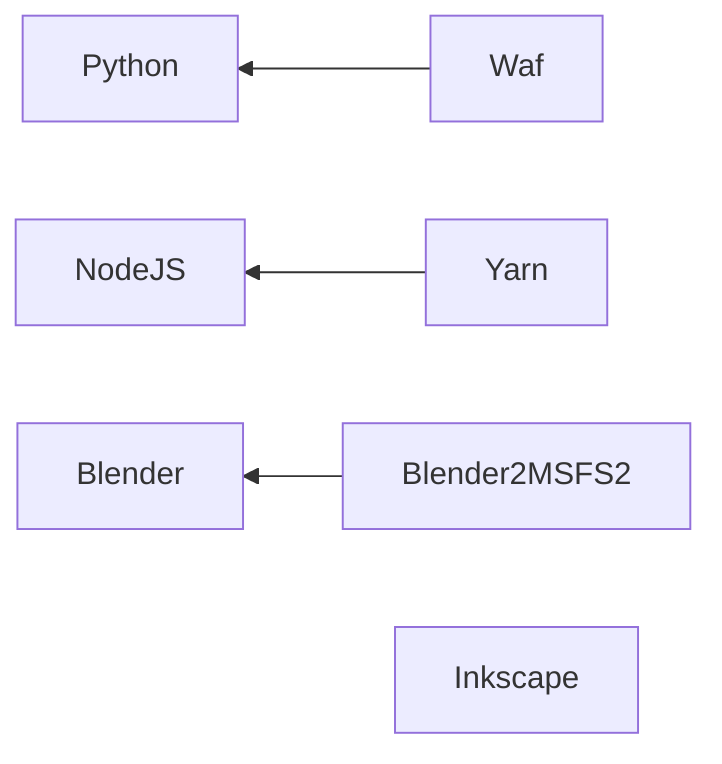

# Ilyushin-96-300

Ilyushin Il-96-300 for MSFS/XPlane12/Prepar3D/FSX/FS9

## Build Environment

|       Software       |     Type      | Version | Windows | Ubuntu 20.04 | MacOS |
| :------------------: | :-----------: | :------ | :-----: | :----------: | :---: |
|        Python        |    Program    | 3.8     |    √    |      √       |   √   |
|        NodeJS        |    Program    | 18.12.1 |    √    |      √       |   √   |
|       Blender        |    Program    | 3.3.1   |    √    |      √       |   √   |
|       Inkscape       |    Program    | 1.2.1   |    √    |      √       |   √   |
|         Waf          | Python script | 2.0.24  |    √    |      √       |   √   |
| fake-bpy-module-3.1  | Python module | 3.1     |    √    |      √       |   √   |
|        Pillow        | Python module | 9.3.0   |    √    |      √       |   √   |
|         Yarn         | NodeJS module | 1.22.19 |    √    |      √       |   √   |
| glTF-Blender-IO-MSFS | Blendon Addon | 1.1.6   |    √    |      √       |   √   |

## Development Plan

- [ ] Experimental Stage
- [ ] Development Stage
- [ ] Test and Debug Stage
- [ ] Release and Maintainance Stage

# Instruments

## MCP ПУ-56

## MCDU ПУИ-85

## IAS Indicator Указатель приборной скорости УС-2

## ADI АГБ-96-15Р

## RMI Радиомагнитный индикатор РМИ-ЗБ

## 8.14.1.4. Резервные приборы (Backup)

* А. Общие сведения
* Б. Резервный авиагоризонт АГБ-96-15Р
* В. Высотомер ВЖ-2
* Г. Указатель приборной скорости УС-2
* Д. Вариометр ВР-ЗОПБ
* Е. Магнитный компас КИ-13
* Ж. Радиомагнитный индикатор РМИ-ЗБ
* З. Часы ЧАС-1

# Equipments

* 8.1 Силовая установка
* 8.2 Вспомогательная силовая установка
* 8.3 Топливная система
* 8.4 Гидравлическая система
* 8.5 Электроснабжение
* 8.6 Управление самолетом
* 8.7 Шасси
* 8.8 Системы кондиционирования и автоматического регулирования давления воздуха
* 8.9. Кислородное и дымозащитное оборудование
* 8.10, Противообледенительная система
* 8.11. Противопожарное оборудование
* 8.12. Пилотажно-навигационный комплекс
* 8.13. Автоматическое управление самолетом
* 8.14. Пилотажное оборудование
* 8.15. Навигационное оборудование
* 8.16. Аппаратура УВД, опознавания и система предупреждения столкновений
* 8.17. Освещение и сигнализация
* 8.18. Остекление, двери и люки
* 8.19. Бытовое оборудование
* 8.20 Аварийно-спасательное оборудование
* 8.21. Системы сигнализации и информации
* 8.22 Системы внутрисамолетной связи, оповещения и развлечения пассажиров
* 8.23 Радиосвязное оборудование
* 8.24 Системы регистрации полетных данных

## 8.1 Power System

## 8.2 Auxiliary Power Unit

## 8.3 Fuel System

## 8.4 Hydraulic System

## 8.5 Power Supply

## 8.6 Aircraft Control

## 8.7 Landing Gears

## 8.8 Air Conditioning And Automatic Air Pressure Control Systems

## 8.9. Oxygen And Smoke Protection Equipment

## 8.10, Anti-Icing System

## 8.11. Fire-Fighting Equipment

## 8.12. Flight And Navigation Complex

## 8.13. Automatic Aircraft Control

## 8.14. Flight Equipment

## 8.15. Navigation Equipment

## 8.16. ATC Equipment, Identification And Collision Avoidance System

## 8.17. Lighting And Signaling

## 8.18. Glazing, Doors And Hatches

## 8.19. Household Equipment

## 8.20 Survival Equipment

## 8.21. Signaling And Information Systems

## 8.22 In-Aircraft Communications, Public Address And Entertainment Systems For Passengers

## 8.23 Radio Communication Equipment

## 8.24 Flight Data Recording Systems

# References

## Fonts

* [шрифт авиационный + госты](https://www.avsim.su/f/documents-16/font-aviation-guests-29276.html)
* [шрифт для работы с панелями](https://www.avsim.su/f/fs2004-for-designers-37/font-to-work-with-the-panels-18335.html)